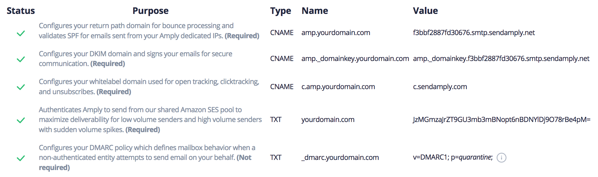
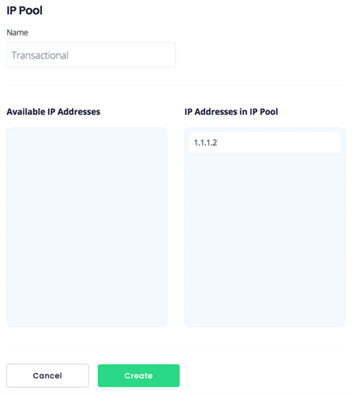
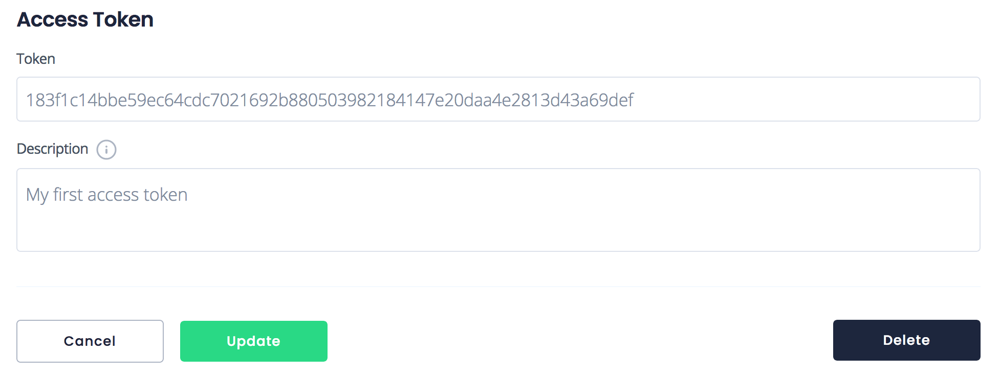
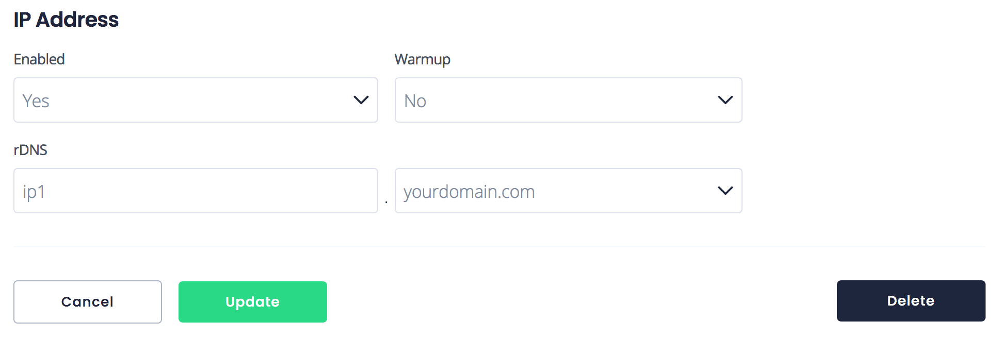

# Quickstart Guide

#### Learn how to start sending email with Amply in just a few minutes. 

You can begin using Amply as soon as you register your account, and requires just a few steps:

1) Sender Verification
2) Create an IP Pool
3) Provision an Access Token
4) Integrate via SMTP Relay or API
5) (Optional) Update rDNS

Follow the guide below to start sending email with Amply! If you haven't created an account yet, you can do so [here.](https://sendamply.com/plans)

****

### 1) Sender Verification

For the security of our customers, we require the sender (whoever is in the *From* header of your email) to be verified. You can verify either an entire domain, *yourdomain.com* or an individual email address, *sender&#64;yourdomain.com*.

This guide goes over verifying an entire domain, but you can check out the [Sender Verification](./Deliverability/A-Sender-Verification.md) article if you'd like more info or if you'd rather verify an individual email address.

Once your domain has been verified, Amply immediately starts warming up your domain and IP reputation. This warmup process will take approximately one week before maximal deliverability has been reached.

#### Verify your domain

Navigate to the "Verified Domains" page by clicking on the "Mail Settings" tab from your dashboard. Click on the "+" sign to add a new Verified Domain.

Enter the domain you'd like to verify in the "Domain Name" input. The DNS records you need to provision will be listed next to it:<br/>

<br/>

To maximize deliverability, you should enforce a DMARC policy (a policy of either *quarantine* or *reject*).  [You can read more about the implications of doing that here.](Deliverability/D-DMARC.md) If you're unable to enforce DMARC on your main domain, you can send mail from a subdomain (like *mail.yourdomain.com*) and set up the record there.  If necessary, you can set your policy to *none*, but this is not recommended and may reduce deliverability.

Four green checkmarks will be displayed once you've added the records.

<!-- theme: info -->
> DNS changes may take up to 48 hours to take effect (depending on the TTL of the record).

Click on "Create", and you have successfully verified your domain!

****

### 2) Create an IP Pool

An IP Pool is a collection of IP addresses. We automatically create a pool called Global when you register your account. The Global pool is every IP that is allocated to your account. We recommend that you create two separate pools for transactional and marketing email.

Having two separate pools means you can associate different IPs with each type of email that you send.

For mission-critical emails, you can have a pool of IPs whose reputation needs to remain immaculate to maintain the highest level of deliverability.

For emails that are more likely to be marked as spam, like marketing emails, you can have a set of IPs dedicated just for that. This way reputation dings in one pool won't affect the reputation of the other.

A good configuration would be something like:

Pool Name | IPs
---------|----------
 Transactional | 1.1.1.1, 1.1.1.2, ... as many as needed
 Marketing | 1.1.2.1, 1.1.2.2, ... as many as needed

 The most important thing is that there is no overlap in IPs between the Transactional pool and the Marketing pool.

#### Create the pool

Navigate to the "IP Pools" page by clicking on the "Mail Settings" tab from your dashboard. Click on the "+" sign to add a new IP Pool. Drag the IPs you want to associate with the pool into the "IP Addresses in IP Pool" column.



Take note of the UUID of the pool you've created; we'll use this in Step 4.

****

### 3) Provision an Access Token

Access Tokens are an alternative to passwords for authentication to Amply when using the API or the SMTP relay.

#### Create the token

Navigate to the "Access Tokens" page by clicking on the "Mail Settings" tab from your dashboard. You can use the existing token, or click on the "+" sign to add a new Access Token.



Take note of the token's secret value; we'll use this in Step 4.

****

### 4) Integrate via SMTP Relay or API

There are two ways to send email with Amply: via our [SMTP relay](Integrations/SMTP-Relay.md) or [REST API](https://docs.sendamply.com/docs/api/docs/Introduction.md). Both are highly effective methods of delivering email so choose whatever is best for your use case.

Here are a few things to keep in mind:

SMTP Relay | REST API
---------|----------
 Easy to set up and integrate | Easy to secure (all connections sent over HTTPS)
 Platform independent | Expanded functionality but more complex (requires technical know-how)
 Established email standard | Easily accessible if your ISP blocks traffic on mail ports

In this guide, we'll send an email using the API via a simple cURL request. You can take a deeper look at setting up the SMTP relay or API here:

- [SMTP relay](Integrations/SMTP-Relay.md)
- [REST API](https://docs.sendamply.com/docs/api/Mail-Send.v1.yaml)
  - [Javascript SDK](https://github.com/sendamply/amply-js), [Python SDK](https://github.com/sendamply/amply-python), [Ruby SDK](https://github.com/sendamply/amply-ruby), [PHP SDK](https://github.com/sendamply/amply-php), [Go SDK](https://github.com/sendamply/amply-go)

#### Send an email

The following cURL request makes a simple HTTP call to our API servers:

```json
curl https://sendamply.com/api/v1/email \
    -H "Authorization: Bearer YOUR_ACCESS_TOKEN" \
    -H 'Content-Type: application/json' \
    --data-binary @- << EOF
    {
      "subject": "Hello, from Amply!",
      "from": {
        "email": "donotreply@verifieddomain.com",
        "name": "John Smith"
      },
      "content": [
        {
          "type": "text/plain",
          "value": "Hi there!"
        }
      ],
      "personalizations": [
        {
          "to": [
            {
              "email": "you@yourdomain.com",
              "name": "Your Name"
            }
          ]
        }
      ],
      "ip_or_pool_uuid": "YOUR_IP_POOL_UUID"
    }
EOF
```

Replace the sender (from address *donotreply&#64;verifieddomain&#46;com*) with a sender from a domain you verified in Step 1. In addition, replace the *YOUR_IP_POOL_UUID* with the IP Pool UUID you created in Step 2. Finally, replace *YOUR_ACCESS_TOKEN* with the access token you created in Step 3.

If you don't specify an IP pool, Amply will send from your Global pool.

That's it! You're ready to start sending email.

****

### 5) (Optional) Update rDNS

Reverse DNS resolution (rDNS) is the querying technique of DNS to determine the domain name associated with an IP address. Email clients look favorably at IP addresses whose rDNS domain name matches the return-path domain.

Since all IP addresses that Amply provisions are dedicated, you are free to update the rDNS record for each of your IPs. You should only do this if you are sending out of one domain. For example, you would NOT want to provision a new rDNS record if you are sending from john&#64;example.com and john&#64;test.com.

If you choose to update your rDNS, navigate to the IP Address you'd like to update by clicking on "Mail Settings" and then "IP Addresses". Select the IP from the list.



In the above example, we set the rDNS domain to *ip1.yourdomain.com*. You don't need to use *ip1*, but you do need to ensure the value is unique, and that you've provisioned an A record with the value of the IP address.