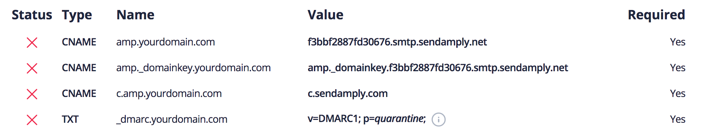
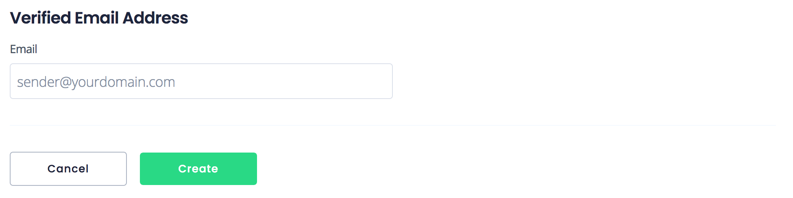

# Sender Verification

To protect the security of our customers, we require you to verify the domain or email address of anyone you are sending on behalf of. There are two ways to verify a sender:

1) [Domain Verification](#domain-verification)
2) [Email Address Verification](#email-address-verification)

Domain Verification is the best way to verify your sender identity because the process requires you to configure your DNS records ([SPF](./200-SPF.md), [DKIM](./300-DKIM.md), and [DMARC](./400-DMARC.md)) which greatly improves the deliverability of your sending infrastructure. It also removes the "_via&nbsp;hostname.smtp.sendamply.net_" message that some email clients append to the "From" field.

****

### Domain Verification

In order to verify your domain, you need to create DNS records that implement [SPF](./200-SPF.md), [DKIM](./200-DKIM.md), and [DMARC](./400-DMARC.md) with the appropriate Amply resources. Once verified, you may send email on behalf of any recipient from your domain (of the format `anyone@yourdomain.com`).

Navigate to the [Verified Domains](https://sendamply.com/home/settings/verified_domains) page from the Mail Settings tab on your dashboard and click on the "+" button to create a new Verified Domain. You'll be prompted to add the following DNS records for the domain (in this example, `yourdomain.com`):

|  Name | Reason |
|---|---|
| **amp.yourdomain.com**  | This is used to set the return-path of your email. Additionally, email clients use this for SPF authentication. |
| **amp._domainkey.yourdomain.com**  | This is used by email clients for DKIM authentication. |
| **c.amp.yourdomain.com** | This is used for clicktracking and our tracking pixel to collect analytics. |
| **_dmarc.yourdomain.com** | This is your DMARC policy and instructs email clients how to respond if an email fails SPF or DKIM authentication. We recommend you set your policy to _quarantine_ or _reject_, but you may set it to _none_ if you are unable to enforce a policy. |

<!-- theme: info -->
> We have found that setting a DMARC policy to _quarantine_ or _reject_ significantly improves the deliverability of your email because it increases your sender score with popular email clients like Gmail and Outlook.

#### Resources to update records for popular DNS providers

- [AWS Route53](https://docs.aws.amazon.com/Route53/latest/DeveloperGuide/resource-record-sets-editing.html)
- [GoDaddy](https://www.godaddy.com/help/add-a-cname-record-19236)
- [Google Cloud](https://cloud.google.com/dns/docs/records)
- [Rackspace](https://support.rackspace.com/how-to/creating-dns-records-with-cloud-dns/)

#### Add your domain

Once you've provisioned your DNS records, you'll see four green checkmarks indicating that the records have been set up correctly. Click on "Create", and you've successfully verified your domain and will be able to send email on behalf of any sender in that domain!

****

### Email Address Verification

Email Address Verification is the easiest way to verify your sender identity. However, it is more restrictive than verifying your domain because you can only send on behalf of a specific sender (rather than anyone in your domain). In addition, you don't get the benefit of setting up [SPF](./200-SPF.md), [DKIM](./300-DKIM.md), and [DMARC](./400-DMARC.md) as you do with verifying your domain and therefore won't get the improved deliverability like you would with [Domain Verification](#domain-verification).

Navigate to the [Verified Email Address](https://sendamply.com/home/settings/verified_email_addresses) from the Mail Settings tab on your dashboard and click on the "+" button to create a new Verified Email Address. You'll be prompted to add the email address you want to verify:

After clicking "Create", we'll send an email to address you are trying to verify. Once you click the link in that email, your email address will be verified, and you'll be authenticated to start sending email through that address!
