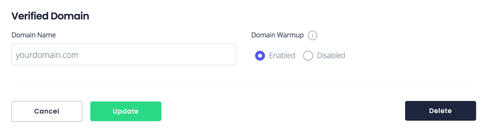

# Domain Warmup

Mailbox providers like Gmail and Outlook primarily care about two things when it comes to email deliverability: _IP reputation_ and _domain reputation_. Your reputation can either be _positive_, _negative_, or _neutral_.

You must have at least one positive reputation factor, and no negative factors to achieve a high level of deliverability.

Since Amply only provisions dedicated IP addresses, your IP reputation starts off as neutral and grows positive as you send email. If you're a low volume sender (< 200 emails/day), you haven't established a domain reputation yet and providers will classify you as a neutral sender.

In order to kickstart your sending infrastructure, enable domain warmup for any verified domain that you send from. Amply generates positive interactions with your email and establishes a positive reputation for your domain.

<!-- theme: success -->
> This reputation gain from Amply's domain warmup improves deliverability on **ALL** email that you send from your domain, not just the emails through Amply.

<!-- theme: info -->
> ##### How long does warmup take?
>
>Warmup takes approximately one week. If you're sending from a low volume domain, your deliverability will be low (emails sent to spam) until we've warmed it up at all the mailbox providers. Once warmed up, you're good to go!

****

### Why dedicated IPs are necessary

When you send from your own IP, you have full control of your sending reputation. You don’t run into the risks that come from sharing an IP address with neighbors.

For instance, if you share an IP address with a business that sends a lot of spam messages, that would negatively affect the domain that you’re sending from, and reduce deliverability from your IP. This would also place you at a higher risk of ending up on a blacklist, which would block any of your emails from being delivered and be detrimental to your reputation. 

Without a dedicated IP, it's a matter of time before a spammer causes it to be blacklisted, and you lose email deliverability for a few days. By starting off with a dedicated IP, you're building a healthy sending infrastructure from the first email you send!

****

### Enabling domain warmup

Domain warmup can be enabled from your dashboard. Navigate to Mail Settings -> Verified Domains, and click on the domain that you want to enable warmup on.

Under Domain Warmup, click "Enabled". You're all set!