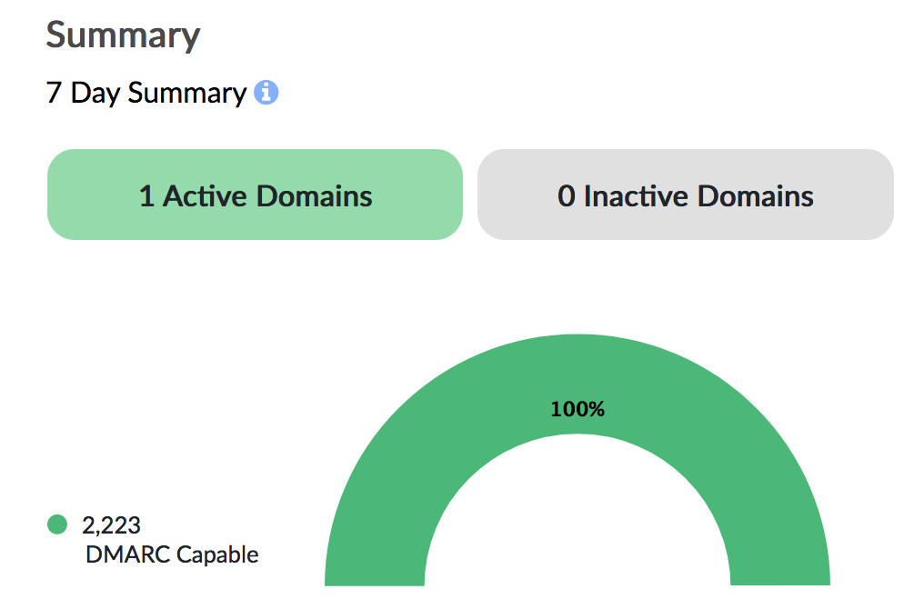

# DMARC

DMARC stands for Domain-based Message Authentication, Reporting and Conformance and is an email-validation system designed to detect and prevent email spoofing by solving operational and reporting issues related to the SPF and DKIM email authentication protocols.

DMARC instructs mailbox providers on how to handle unauthenticated email through a DMARC policy that you create in a DNS TXT record. This removes any guesswork on how mailbox providers should handle messages that fail DMARC authentication. **An enforced DMARC policy is the most important thing you can do to prevent phishing and spoofing attacks.**

In addition, an enforced DMARC policy (either *quarantine* or *reject* in the *p* tag) will greatly improve deliverability, and is a necessary step for low volume senders (less than 500 emails per day) who have not established a sending reputation.

****

### Setting your DMARC Record

To pass DMARC, your email must pass either or both of:

- SPF authentication and SPF alignment (Header From and Return-Path domains match)
- DKIM authentication and DKIM alignment (DKIM Signing domain and Header From domain match)

Mailbox providers send regular DMARC aggregate and forensic reports back to senders, giving you visibility into what messages are authenticating, what messages are not and why.

The following table illustrates some of the configuration options you can specify when creating your DMARC record:

Tag | Purpose | Values | Example
---------|----------|---------
 v | Protocol version | DMARC1 | v=DMARC1
 pct | Percentage of messages subjected to filtering | Number from 0 to 100 | pct=15
 ruf | Reporting URI for forensic reports | mailto address |ruf=mailto:authfail&commat;example.com
 rua | Reporting URI of aggregate reports | mailto address | rua=mailto:aggrep&commat;example.com
 p | Policy for organizational domain | none - no action is taken quarantine - failing messages are sent to spam folder reject - failing messsages are not delivered | p=quarantine
 sp | Policy for the subdomains of the organizational domain |none - no action is taken quarantine - failing messages are sent to spam folder reject - failing messsages are not delivered  | sp=reject
 adkim | Alignment mode for DKIM | r (relaxed) or s (strict) |adkim=r
 aspf | Alignment mode for SPF | r (relaxed) or s (strict) | aspf=s

For example, the following DMARC record will notify postmaster&commat;example.com and send the email to spam (*p=quarantine*) on a failed check:

> NAME _dmarc.example.com IN TXT  "v=DMARC1; p=quarantine; rua=mailto:postmaster&commat;example.com"

**Important:** If your records are not aligned, make sure that you set your policy to none, instead of quarantine or reject. Although quarantine and reject will increase your deliverability rate, DMARC will fail if your records are not aligned and your email will automatically be sent to spam or be rejected.

***

### Safely transitioning to an enforced DMARC policy

Most organizations send email from many different sources. For example, you may be sending your client based email from Gmail, your support email through Salesforce, and your transactional email through a provider like Amply.

In order to enforce your DMARC policy, you need to ensure that each source you send from passes SPF and DKIM (and the records are aligned) otherwise you run the risk of legitimate email failing authentication and not being delivered.

Every provider (Gmail, Salesforce, Hubspot, Marketo, Mailchimp, etc) supports SPF and DKIM, and set up should take less than 5 minutes.

There are a few steps you can take to ensure you enforce your policy safely:

#### 1) Set up reporting

If you want to set up a policy DMARC policy for *yourdomain.com*, create the following DNS TXT record:

> NAME _dmarc.yourdomain.com IN TXT  "v=DMARC1; p=none; rua=mailto:reporter&commat;dmarcian.com"

The *rua* tag specifies an address where email clients should send their aggregate reports. The *p=none* means that your policy is NOT enforced, but you will receive reports on what is passing and failing.

[You can create a free Dmarcian account here which will monitor these reports for you.](https://dmarcian.com/) Replace *reporter&commat;dmarcian.com* in your record with the address they give you.

Once you've set up your Dmarcian account and added your domain, you can easily analyze your DMARC reports.

#### 2) Monitor reports

Wait at least a week (for large organizations sending 1M+ emails/mo, we recommend a month) to identify sources that are emailing on behalf of your domain. If your report looks similar to this:

Then that means you can proceed to the next step.

If you have failures, identify which sources are failing, ensure they are legitimate, and set up SPF and DKIM on behalf of that sender to ensure they pass.

#### 3) Enforce DMARC

Once you've ensured that all legitimate email sources sending on behalf of your domain have properly set up SPF and DKIM records, then it is safe to set your DMARC policy to *p=quarantine* or *p=reject*.

A policy of quarantine means failing emails will be sent to your recipient's spam folder, while reject means they will not be delivered at all.

Congrats! You are now securely sending email and malicious users will not be able to spoof email on behalf of your domain.
