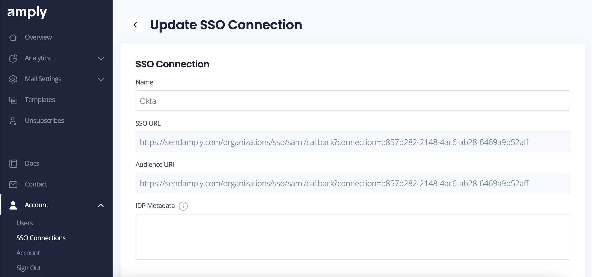

# Okta

Amply supports single-sign on via Okta (using SAML). Currently supported features include:

- IDP-initiated SSO
- Just-in-time provisioning

This guide outlines the setup process for authenticating to Amply with Okta. If you have any questions during the setup process, please contact support (support@sendamply.com) for assistance.

### Create Amply SSO connection

Navigate to [Account -> SSO Connections](https://sendamply.com/home/sso_settings) from your Amply dashboard. Click the **+** to add a new SSO connection.

Enter a name for the connection, and click **Create** to add the connection to Amply.

### Create Okta Application

In your Okta account, go to **Applications** and click **Create App Integration**.

Choose **SAML 2.0**.

Click **Next** to continue.

### Configure General Settings

From the next page, enter the following details:

- **App name**: Amply
- **App logo** (optional): You can download the [Amply logo](https://sendamply.com/logo.png), and upload it to Okta to use as the logo for this app

Click **Next** to continue.

### Configure SAML

From the SSO connection you created in your Amply dashboard, copy the SSO URL and Audience URI.

Navigate back to Okta and enter these values for the **SSO URL** and **Audience URI**. Under **Name ID Format**, select *EmailAddress*.

Click **Next** to continue.

### Finish Okta setup

Select **I'm an Okta customer adding an internal app** and then **Finish**.

### Add IDP metadata to Amply

On the next page in Okta, click **View Setup Instructions**.

Scroll to the bottom of the page, and copy the XML under **Provide the following IDP metadata to your SP provider**.

Paste this into **IDP Metadata** in Amply.

Click **Update** to finish setup.

### Test Okta connection

Import users and groups to your new Okta app. From here, you can launch your Amply app to authenticate with Okta SSO!
