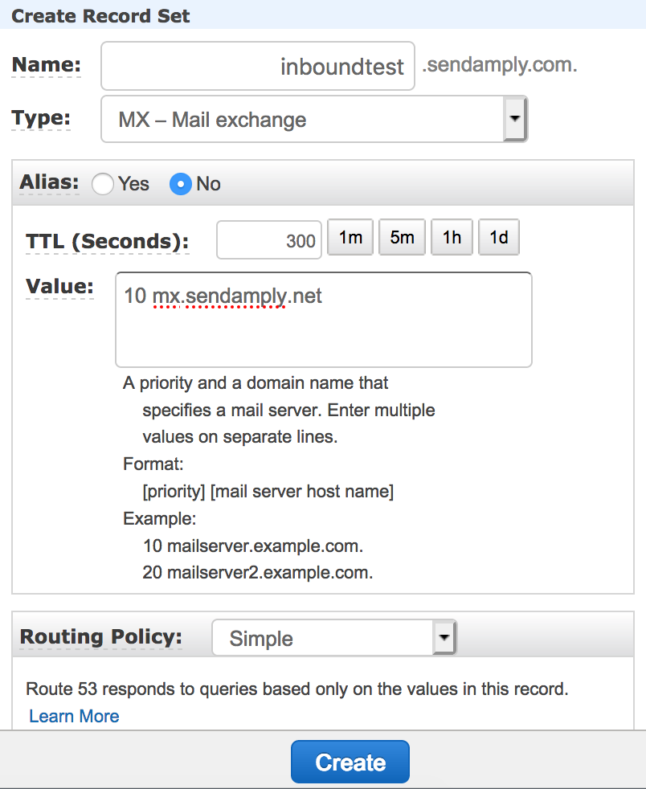
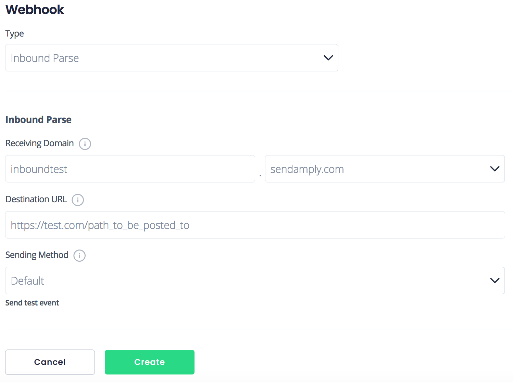

# Inbound Parses

Inbound parse webhooks process all incoming email for a domain or subdomain, parse the contents and attachments, and POST json data to a URL that you choose.

To begin processing email using Amply's inbound parse webhook, you will have to set up an MX record, choose the receiving domain that will be receiving the emails you want to parse, and define the URL where you want to POST your parsed emails.

****

### Create an Inbound Parse Webhook

#### Step 1: Create your MX Record

An MX record is a special type of DNS record that specifies the mail server responsible for accepting emails on behalf of a domain.

1. Navigate to the MX Records page on your hosting provider’s website. If you’re unsure who your hosting or DNS provider is, please contact your website administrator.
2. Create a new MX record for the fully qualified domain (e.g. *inboundtest.yourdomain.com*) you want to process incoming email. It is important that this domain is exclusively used to parse your incoming email.
3. Assign the MX record a priority of 10, and point it to the address: *mx.sendamply.net*.

It should look like this:



#### Step 2: Create the Inbound Parse Webhook in Amply

From the Amply dashboard, click on the Mail Settings tab and then Webhooks. Click the "+" button to add a new Inbound Parse Webhook.

From this page, specify the subdomain (optional) and the domain of the receiving domain. [This domain must be verified](../Deliverability/100-Sender-Verification.md#domain-verification). All emails sent to this receiving domain will be parsed. Enter the public URL where you would like the parsed data to be POSTed.




You can set the **Sending Method** to Raw if you would prefer to receive the full MIME message URL encoded in multipart/form-data.


Click on "Create" to create the webhook. You can test that this is working by sending an email to the address that you set up (in this example, *test@inboundtest.yourdomain.com*).

****

### Response Params

#### Default Parameters

Key | Description
---------|----------|---------|
**attachments** | An array containing attachment objects containing the fields: **name**, **content_type**, **content_length**, **content_id**, **content**. **content** is base64 encoded. If the attachment file size exceeds 50MB, the **content** value will be an empty string.
 **cc** | Email cc field, as taken from the message headers.
 **envelope** | A JSON string containing two fields: **to** and **from**. **To** is an array of recipients and **from** is a string representing the return path for the email.
 **from** | Email sender, as taken from the message headers.
 **headers** | A JSON string containing an array of hashes where the key is the header name, and value is the header value.
 **html** | The html body of the email. If not set, this will be an empty string.
 **inbound_parse_webhook** | A JSON string containing three fields: id, fqdn, and destination_url. Id is the ID of the inbound parse webhook that is processing the request, fqdn is the domain of the receiving host, and destination_url is the URL that Amply will POST to.
 **sender_ip** | The sender's IP address.
 **subject** | The subject of the email.
 **text** | The text body of the email. If not set, this will be an empty string.
 **to** | Email recipient field, as taken from the message headers.


**Example Payload with Default Parameters**

```json
{
  "events": [
    {
      "type": "inbound_parse",
      "data": {
        "attachments": [
          {
            "name": "myfile.html",
            "content_type": "text/hml",
            "content_length": 13,
            "content_id": "f_khuvi3jn0",
            "content": "PGI+SGVsbG8hPC9iPg=="
          }
        ],
        "cc": null,
        "envelope": {
          "to": [
            "to@yourdomain.com"
          ],
          "from": "from@example.com"
        },
        "from": "Sender <from@example.com>",
        "headers": [
          {
            "Date": "Mon, 26 Oct 2020 10:33:39 -0700"
          },
          {
            "From": "Sender <from@example.com>"
          },
          {
            "To": "to@yourdomain.com"
          },
          {
            "Message-ID": "<abc123@example.com>"
          },
          {
            "Subject": "Testing :)"
          },
          {
            "Mime-Version": "1.0"
          },
          {
            "Content-Type": "multipart/alternative; boundary=\"000000000000571fa205b296554f\""
          }
        ],
        "html": "<p>Hello!</p>",
        "inbound_parse_webhook": {
          "id": 1,
          "type": "inbound_parse",
          "destination_url": "https://yourwebhookdestination.com",
          "receiving_domain": "yourdomain.com",
          "subdomain": "",
          "verified_domain_id": 1,
          "sending_method": "default",
          "created_at": "2020-11-23T15:03:33-08:00"
        },
        "sender_ip": "1.2.3.4",
        "subject": "Testing :)",
        "text": "Hello!",
        "to": "to@yourdomain.com",
        "created_at": "2020-11-23T15:13:33-08:00"
      }
    }
  ]
}
```


#### Raw Parameters


 **cc** | Email cc field, as taken from the message headers.
---------|----------|---------
 **email** | A string containing the email headers, date, body, and attachments.
 **envelope** | A JSON string containing two fields: to and from. To is an array of recipients and from is a string representing the return path for the email.
 **sender_ip** | The sender's IP address.
 **subject** | The subject of the email.
 **to** | Email recipient field, as taken from the message headers


 #### Example Payload with Raw Parameters

```json
{
  "events": [
    {
      "type": "inbound_parse",
      "data": {
        "cc": null,
        "email": "Date: Mon, 26 Oct 2020 10:33:39 -0700\r\nFrom: Sender <from@example.com>\r\nTo: to@yourdomain.com\r\nMessage-ID: <abc123@example.com>\r\nSubject: Testing :)\r\nMime-Version: 1.0\r\nContent-Type: multipart/mixed;\r\n boundary=\"--==_mimepart_5f973596a99ad_15c5c23b98c792fb\";\r\n charset=UTF-8\r\nContent-Transfer-Encoding: 7bit\r\n\r\n\r\n----==_mimepart_5f973596a99ad_15c5c23b98c792fb\r\nContent-Type: text/plain;\r\n charset=UTF-8\r\nContent-Transfer-Encoding: 7bit\r\n\r\nHello!\r\n----==_mimepart_5f973596a99ad_15c5c23b98c792fb\r\nContent-Type: text/html;\r\n charset=UTF-8\r\nContent-Transfer-Encoding: 7bit\r\n\r\n<p>Hello!</p>\r\n----==_mimepart_5f973596a99ad_15c5c23b98c792fb--\r\n",
        "envelope": {
          "to": [
            "to@yourdomain.com"
          ],
          "from": "from@example.com"
        },
        "from": "Sender <from@example.com>",
        "sender_ip": "1.2.3.4",
        "subject": "Testing :)",
        "to": "to@yourdomain.com"
      }
    }
  ]
}
```

***

### Retries

If the destination URL for you webhook times out (takes longer than 5 seconds to receive a request) or returns a non 2xx response code, we will attempt to resend the request up to 6 times, in increments of 1 hour.
