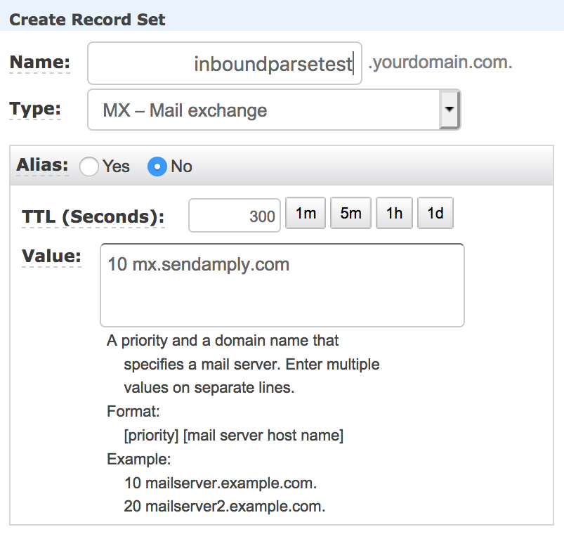

# Inbound-Parse

## Introduction

Amply can help you process email using the Inbound Parse Webhook. This webhook processes all incoming email for a domain or subdomain, parses the contents and attachments, then POSTs multipart/form-data to a URL that you choose.

To begin processing email using Amply's Inbound Parse Webhook, you will have to setup MX Records, choose the receiving domain that will be receiving the emails you want to parse, and define the URL where you want to POST your parsed emails.


### Step 1: Set your MX Record

1. Navigate to the MX Records page on your hosting provider’s website. If you’re unsure who your hosting or DNS provider is, please contact your website administrator.
2. Create a new MX record for the subdomain (e.g. inboundparsetest.yourdomain.com) you want to process incoming email. It is important that this domain is exclusively used to parse your incoming email.
3. Assign the MX record a priority of 10, and point it to the address: mx.sendamply.com.

It should look like this:




### Step 2: Create the webhook in Amply

From the Amply Dashboard click Infrastructure, and then click Inbound Parse Webhooks. Click the Create button to add a new Inbound Parse Webhook.

From this page, specify the subdomain (optional) and the root domain of the receiving domain. All emails sent to this receiving domain will be parsed. Enter the public URL where you would like the parsed data to be POSTed.


You may set the **Sending Method** to Raw if you would prefer to receive the full MIME message URL encoded in multipart/form-data.


#### Testing

To test that your Inbound Parse Webhook has been set up correctly, send an email to test@inboundparsetest.yourdomain.com.


#### Default Parameters


attachments | The number of attachments included in the email.
---------|----------|---------
 **attachment-info** | A JSON string containing an array of objects (JSON key attachmentX) containing two fields: filename and type.
 **cc** | Email cc field, as taken from the message headers.
 **envelope** | A JSON string containing two fields: **to** and **from**. **To** is an array of recipients and **from** is a string representing the return path for the email.
 **from** | Email sender, as taken from the message headers.
 **headers** | A JSON string containing an array of hashes where the key is the header name, and value is the header value.
 **html** | The html body of the email. If not set, this will be an empty string.
 **inbound_parse_webhook** | A JSON string containing three fields: id, fqdn, and destination_url. Id is the ID of the inbound parse webhook that is processing the request, fqdn is the domain of the receiving host, and destination_url is the URL that Amply will POST to.
 **sender_ip** | The sender's IP address.
 **subject** | The subject of the email.
 **text** | The text body of the email. If not set, this will be an empty string.
 **to** | Email recipient field, as taken from the message headers.


**Example Payload with Default Parameters**

``json
{
  "attachments": "1",
  "attachment1": #<ActionDispatch::Http::UploadedFile:0x00007fe055d3d488 @tempfile=#<Tempfile: (closed)>, @original_filename="file.txt", @content_type="application/octet-stream", @headers="Content-Disposition: form-data; name=\"attachment1\"; filename=\"file.txt\"\r\nContent-Type: application/octet-stream\r\n">,
  "attachment_info": "[{\"attachment1\":{\"filename\":\"file.txt\",\"type\":\"text/plain\"}}]",
  "cc": "",
  "envelope": "{\"to\":[\"test@inboundparsetest.yourdomain.com\"],\"from\":\"sender@sendamply.com\"}",
  "from": "Sender <sender@sendamply.com>",
  "headers": "[{\"Date\":\"Thu, 12 Sep 2019 19:51:09 -0700\"},{\"From\":\"Sender <sender@sendamply.com>\"},{\"To\":\"test@inboundparsetest.yourdomain.com\"},{\"Message-ID\":\"<CAG9TFY8TGFhiCOW+o5gqCJfQkg+jNrgot1hqzFO8Q-cHJG0ZNA@mail.gmail.com>\"},{\"Subject\":\"Testing!\"},{\"Mime-Version\":\"1.0\"},{\"Content-Type\":\"multipart/mixed; boundary=\\\"000000000000380bc3059266543f\\\"\"},{\"DKIM-Signature\":\"v=1; a=rsa-sha256; c=relaxed/relaxed; d=sendamply.com; s=google; h=mime-version:from:date:message-id:subject:to; bh=iTJcSPHxwjfshRzBw+8pr9FqmWBiNPX9tMjvesJMGNY=; b=go48DYVfVu69VzPfwTMHw9sf7hyxevSfttaXE5QfMmeRs9K/YmmbI577abPG3wboU2h9ybc25DaFBHhvEa9CgPvEu2szxX9V54Mg7ylxfDFTWI5AUUWhmgSu5ChNyXmgcKdSGSddhnnn3BMGoslqiWY5g9x2LdK9jv8w1etdeTo=\"},{\"X-Google-DKIM-Signature\":\"v=1; a=rsa-sha256; c=relaxed/relaxed; d=1e100.net; s=20161025; h=x-gm-message-state:mime-version:from:date:message-id:subject:to; bh=iTJcSPHxwjfshRzBw+8pr9FqmWBiNPX9tMjvesJMGNY=; b=hG6JoatkqWCXV2ijQz6Z4YFPVZquz8kZ3KXUSVIA3NnGEYxBfsDTkxJg5NSzBajIiFkyNkwJDAvAIhdNbioTCS/GP3q0R8zlt6viZ7coHgsN8NpWKruE8Y7Cr0RDCQX5zImGca4zIUcmwXABGcoKaOpkxEqf/8sna+ttKbhwbv3AjEEvrz1R1y8LhyNVWypd6E2tyfa8G00eIwMvvL99pxYxpZcQ/U0oZys9hkqzRMHuCPVaqfrzhCt6boylu7gn899mm1ZFSULFUjVEL0cCfYsKAsxQLMWqOGWVDvjjijQ7STIpKe2xYX2Rq4xJClL7P/H2z8Hd1o811yCICF10SA==\"},{\"X-Gm-Message-State\":\"APjAAAXdVOa4dR4TXDJYngsnVqHMSq6k613Q2Qcb/2PWEhKIwKSgBxyJ\\tTam9HRlHbLt6S0zNJcTsiwrmwFevqlinbvDtBNnuKnv/F3sSJA==\"},{\"X-Google-Smtp-Source\":\"APXvYqwF63fzNS+tk28h25ThOlhjs21WhZoJDQPTpZtmNDHD6iMOhubvYSarAFWvNg965pvzTBPA7wLCFltbiitURRg=\"},{\"X-Received\":\"by 2002:a02:698d:: with SMTP id e135mr48544459jac.128.1568343080812; Thu, 12 Sep 2019 19:51:20 -0700 (PDT)\"}]",
  "html": "<div dir=\"ltr\">This is a test :)<br clear=\"all\"></div>\n",
  "inbound_parse_webhook": "{\"id\":1,\"fqdn\":\"inboundparsetest.yourdomain.com\",\"destination_url\":\"https://www.example.com/your_api_endpoint\"}",
  "sender_ip": "1.2.3.4",
  "subject": "Testing!",
  "text": "This is a test :)\n",
  "to": "test@inboundparsetest.yourdomain.com"
}
``

**Raw Parameters**


 **cc** | Email cc field, as taken from the message headers.
---------|----------|---------
 **email** | A string containing the email headers, date, body, and attachments.
 **envelope** | A JSON string containing two fields: to and from. To is an array of recipients and from is a string representing the return path for the email.
 **sender_ip** | The sender's IP address.
 **subject** | The subject of the email.
 **to** | Email recipient field, as taken from the message headers


 **Example Payload with Default Parameters**

`{
  "cc": "",
  "email": "Date: Thu, 12 Sep 2019 20:05:22 -0700\r\nFrom: Sender <sender@sendamply.com>\r\nTo: test@inboundparsetest.yourdomain.com\r\nMessage-ID: <CAG9TFY-2-pU=hseHTsMJMHm=5xRt0+f1rY0LUO+g5A84YGAkPw@mail.gmail.com>\r\nSubject: Testing!\r\nMime-Version: 1.0\r\nContent-Type: multipart/alternative;\r\n boundary=00000000000010b9d6059266878b\r\nContent-Transfer-Encoding: 7bit\r\nDKIM-Signature: v=1; a=rsa-sha256; c=relaxed/relaxed; d=sendamply.com;\r\n s=google; h=mime-version:from:date:message-id:subject:to; \r\n bh=dzz+0rtoTHw62UCVZJWzt8EGq917iyUkhuCSChS683A=;\r\n b=GvPsGGRt2MvK+ZLVOtLemYC4ouplcyxM/FY0ZhzctA8ognrfVgSNkrdxxpy2AMIN3W\r\nPr1rL5+kIwwLAcmzfc9c1h3wo2ujO2Qlx/LpJcXHY8e+DnAzVvHNPzQ8CjmDcJCfIN3h\r\n RYOWziPEWblb49P0Xy5OvJK6bi1GEmQtBj/Dk=\r\nX-Google-DKIM-Signature: v=1; a=rsa-sha256; c=relaxed/relaxed;\r\n d=1e100.net; s=20161025;\r\n h=x-gm-message-state:mime-version:from:date:message-id:subject:to;\r\n bh=dzz+0rtoTHw62UCVZJWzt8EGq917iyUkhuCSChS683A=;\r\n b=PZ3AagpvKS6ieGMERFkxaDt/tE2/cD7fL6gDn3yXQVqIGyTek7kVeMh3dB5N6+KXTH\r\n 9zr33dLS9PjJVG8JZEQxiZm6ajK21dv9SxDnev0m4hxxlgTeCZKg6fZnIg3EVF70g3xz\r\n bykgUVBFejZTDIEbjsUUmRWM6btnRKvtvJexntS+3VGrwP3NWdLD611C/Bay626G0HzM\r\n gI63129baV7Y5ziBpnqZDuLCY4zRjfMB8joIB//AEDUblQ2p6kI0PQ3EfcAQuR+6uTwJ\r\n 3xAymmYAlfmLZWra5kuotUarWzEU3LsN9D913en2/kjQ7+zO1ipuYkTqRWN3JD03KImV\r\n OWwA==\r\nX-Gm-Message-State: APjAAAXy9602I0ulZ0xU6Lcy4WH4Tu2VOqUcxJvqBYVzHjcj5D0XnbHc\r\n EdGSRNQiVQsBv1Tj54Vr1BpeiNQI2YqgoQuls8kHM98VoVksUg==\r\nX-Google-Smtp-Source: APXvYqxuC6zsmyLl8hFsMLOee8edlC+/992NbQt8TZjx7n2F2v4Kt0GW8UtN/eO0pH8ZXQlJ15gK5M4MF9+FZdSDpHE=\r\nX-Received: by 2002:a02:81ca:: with SMTP id r10mr46494565jag.62.1568343933887;\r\n Thu, 12 Sep 2019 20:05:33 -0700 (PDT)\r\n\r\n\r\n--00000000000010b9d6059266878b\r\nContent-Type: text/plain;\r\n charset=UTF-8\r\nContent-Transfer-Encoding: 7bit\r\n\r\nThis is a test :)\r\n\r\n--00000000000010b9d6059266878b\r\nContent-Type: text/html;\r\n charset=UTF-8\r\nContent-Transfer-Encoding: 7bit\r\n\r\n<div dir=\"ltr\">This is a test :)<br clear=\"all\"></div>\r\n\r\n--00000000000010b9d6059266878b--\r\n",
  "envelope": "{\"to\":[\"test@inboundparsetest.yourdomain.com\"],\"from\":\"sender@sendamply.com\"}",
  "from": "Sender <sender@sendamply.com>",
  "sender_ip": "1.2.3.4",
  "subject": "Testing!",
  "to": "test@inboundparsetest.yourdomain.com"
}`


#### IP Monitoring

Receive an event when one of your users accesses an email that you sent from an unauthorized IP address. The following params will be sent:

```json
["webhook_event"] => "ip_monitoring",
["access_key"]    => "your_access_key_here",
["email_address"] => "test@sendamply.com",
["ip_address"]    => "1.2.3.4",
["email_id"]      => "1"
```

Click here to send a test request to the webhook configured in your Settings page.
