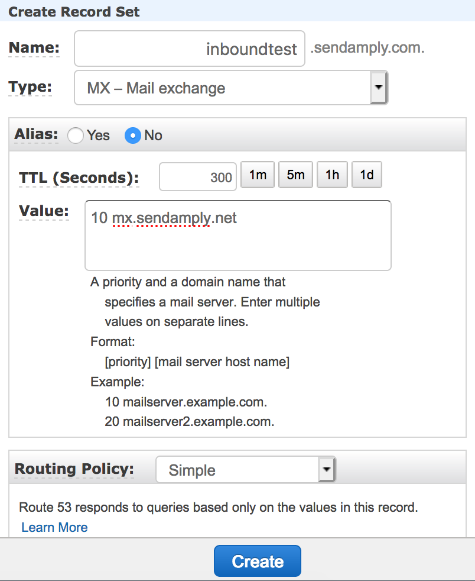

# Inbound Parse Webhooks

Inbound Parse Webhooks process all incoming email for a domain or subdomain, parse the contents and attachments, and POST multipart/form-data to a URL that you choose.

To begin processing email using Amply's Inbound Parse Webhook, you will have to set up an MX record, choose the receiving domain that will be receiving the emails you want to parse, and define the URL where you want to POST your parsed emails.

****

### Create an Inbound Parse Webhook

#### Step 1: Create your MX Record

An MX record is a special type of DNS record that specifies the mail server responsible for accepting emails on behalf of a domain.

1. Navigate to the MX Records page on your hosting provider’s website. If you’re unsure who your hosting or DNS provider is, please contact your website administrator.
2. Create a new MX record for the fully qualified domain (e.g. *inboundtest.yourdomain.com*) you want to process incoming email. It is important that this domain is exclusively used to parse your incoming email.
3. Assign the MX record a priority of 10, and point it to the address: *mx.sendamply.net*.

It should look like this:



#### Step 2: Create the Inbound Parse Webhook in Amply

From the Amply dashboard, click on the Mail Settings tab and then Inbound Parse Webhooks. Click the "+" button to add a new Inbound Parse Webhook.

From this page, specify the subdomain (optional) and the domain of the receiving domain. [This domain must be verified](../Deliverability/A-Sender-Verification.md#domain-verification). All emails sent to this receiving domain will be parsed. Enter the public URL where you would like the parsed data to be POSTed.


You can set the **Sending Method** to Raw if you would prefer to receive the full MIME message URL encoded in multipart/form-data.


Click on "Create" to create the webhook. You can test that this is working by sending an email to the address that you set up (in this example, *test@inboundtest.yourdomain.com*).

****

### Response Params

#### Default Parameters

attachments | The number of attachments included in the email.
---------|----------|---------
 **attachment-info** | A JSON string containing an array of objects (JSON key attachmentX) containing two fields: filename and type.
 **cc** | Email cc field, as taken from the message headers.
 **envelope** | A JSON string containing two fields: **to** and **from**. **To** is an array of recipients and **from** is a string representing the return path for the email.
 **from** | Email sender, as taken from the message headers.
 **headers** | A JSON string containing an array of hashes where the key is the header name, and value is the header value.
 **html** | The html body of the email. If not set, this will be an empty string.
 **inbound_parse_webhook** | A JSON string containing three fields: id, fqdn, and destination_url. Id is the ID of the inbound parse webhook that is processing the request, fqdn is the domain of the receiving host, and destination_url is the URL that Amply will POST to.
 **sender_ip** | The sender's IP address.
 **subject** | The subject of the email.
 **text** | The text body of the email. If not set, this will be an empty string.
 **to** | Email recipient field, as taken from the message headers.


**Example Payload with Default Parameters**

```json
{
  "attachments": "1",
  "attachment1": #<ActionDispatch::Http::UploadedFile:0x00007fe055d3d488 @tempfile=#<Tempfile: (closed)>, @original_filename="file.txt", @content_type="application/octet-stream", @headers="Content-Disposition: form-data; name=\"attachment1\"; filename=\"file.txt\"\r\nContent-Type: application/octet-stream\r\n">,
  "attachment_info": "[{\"attachment1\":{\"filename\":\"file.txt\",\"type\":\"text/plain\"}}]",
  "cc": "",
  "envelope": "{\"to\":[\"test@inboundtest.yourdomain.com\"],\"from\":\"sender@sendamply.com\"}",
  "from": "Sender <sender@sendamply.com>",
  "headers": "[{\"Date\":\"Thu, 12 Sep 2019 19:51:09 -0700\"},{\"From\":\"Sender <sender@sendamply.com>\"}, {\"To\":\"test@inboundtest.yourdomain.com\"}, {\"Message-ID\":\"<CAG9TFY8TGFhiCOW+o5gqCJfQkg+jNrgot1hqzFO8Q-cHJG0ZNA@mail.gmail.com>\"}, {\"Subject\":\"Testing!\"},{\"Mime-Version\":\"1.0\"},{\"Content-Type\":\"multipart/mixed; boundary=\\\"000000000000380bc3059266543f\\\"\"}, {\"DKIM-Signature\":\"v=1; a=rsa-sha256; c=relaxed/relaxed; d=sendamply.com; s=google; h=mime-version:from:date:message-id:subject:to; bh=iTJcSPHxwjfshRzBw+8pr9FqmWBiNPX9tMjvesJMGNY=; b=go48DYVfVu69VzPfwTMHw9sf7hyxevSfttaXE5QfMmeRs9K/ YmmbI577abPG3wboU2h9ybc25DaFBHhvEa9CgPvEu2szxX9V 54Mg7ylxfDFTWI5AUUWhmgSu5ChNyXmgc KdSGSddhnnn3BMGoslqiWY5g9x2LdK9jv8w1etdeTo=\"}, {\"X-Google-DKIM-Signature\":\"v=1; a=rsa-sha256; c=relaxed/relaxed; d=1e100.net; s=20161025; h=x-gm-message-state:mime-version:from:date:message-id:subject:to; bh=iTJcSPHxwjfshRzBw+8pr9FqmWBiNPX9tMjvesJMGNY=; b=hG6JoatkqWCXV2ijQz6Z4YFPVZquz8kZ3KXUSVIA3 NnGEYxBfsDTkxJg5NSzBajIiFkyNkwJDAvAIhdNbioTCS/ GP3q0R8zlt6viZ7coHgsN8NpWKruE8Y7Cr0RDCQX5 zImGca4zIUcmwXABGcoKaOpkxEqf/8sna +ttKbhwbv3AjEEvrz1R1y8LhyNVWypd6E2ty fa8G00eIwMvvL99pxYxpZcQ/ U0oZys9hkqzRMHuCPVaqfrzhCt6boylu7gn899mm1ZFSULFUjVEL0cC fYsKAsxQLMWqOGWVDvjjijQ7STIpKe2xYX2Rq4xJClL7P/ H2z8Hd1o811yCICF10SA==\"}, {\"X-Gm-Message-State\":\"APjAAAXdVOa4dR4TXDJYngsnVqHMSq6k613Q2Qcb/ 2PWEhKIwKSgBxyJ\\tTam9HRlHbLt6S0zNJcTs iwrmwFevqlinbvDtBNnuKnv/F3sSJA==\"}, {\"X-Google-Smtp-Source\":\"APXvYqwF63fzNS+tk28h25ThOlhjs21WhZoJDQPTpZtmNDHD6iMOh ubvYSarAFWvNg965pvzTBPA7wLCFltbiitURRg=\"},{\"X-Received\":\"by 2002:a02:698d:: with SMTP id e135mr48544459jac.128.1568343080812; Thu, 12 Sep 2019 19:51:20 -0700 (PDT)\"}]",
  "html": "<div dir=\"ltr\">This is a test :)<br clear=\"all\"></div>\n",
  "inbound_parse_webhook": "{\"id\":1,\"fqdn\":\"inboundtest.yourdomain.com\",\"destination_url\":\"https://www.example.com/your_api_endpoint\"}",
  "sender_ip": "1.2.3.4",
  "subject": "Testing!",
  "text": "This is a test :)\n",
  "to": "test@inboundtest.yourdomain.com"
}
```


#### Raw Parameters


 **cc** | Email cc field, as taken from the message headers.
---------|----------|---------
 **email** | A string containing the email headers, date, body, and attachments.
 **envelope** | A JSON string containing two fields: to and from. To is an array of recipients and from is a string representing the return path for the email.
 **sender_ip** | The sender's IP address.
 **subject** | The subject of the email.
 **to** | Email recipient field, as taken from the message headers


 #### Example Payload with Raw Parameters

```json
{
  "cc": "",
  "email": "Date: Thu, 12 Sep 2019 20:05:22 -0700\r\nFrom: Sender <sender@sendamply.com>\r\nTo: test@inboundtest.yourdomain.com\r\nMessage-ID: <CAG9TFY-2-pU=hseHTsMJMHm=5xRt0+f1rY0LUO+g5A84YGAkPw@mail.gmail.com>\r\nSubject: Testing!\r\nMime-Version: 1.0\r\nContent-Type: multipart/alternative;\r\n boundary=00000000000010b9d6059266878b\r\nContent-Transfer-Encoding: 7bit\r\nDKIM-Signature: v=1; a=rsa-sha256; c=relaxed/relaxed; d=sendamply.com;\r\n s=google; h=mime-version:from:date:message-id:subject:to; \r\n bh=dzz+0rtoTHw62UCVZJWzt8EGq917iyUkhuCSChS683A=;\r\n b=GvPsGGRt2MvK+ZLVOtLemYC4ouplcyxM/FY0ZhzctA8ognrfVgSNkrdxxpy2AMIN3W\r\nPr1rL5+kIwwLAcmzfc9c1h3wo2ujO2Qlx/LpJcXHY8e+DnAzVvHNPzQ8CjmDcJCfIN3h\r\n RYOWziPEWblb49P0Xy5OvJK6bi1GEmQtBj/Dk=\r\nX-Google-DKIM-Signature: v=1; a=rsa-sha256; c=relaxed/relaxed;\r\n d=1e100.net; s=20161025;\r\n h=x-gm-message-state:mime-version:from:date:message-id:subject:to;\r\n bh=dzz+0rtoTHw62UCVZJWzt8EGq917iyUkhuCSChS683A=;\r\n b=PZ3AagpvKS6ieGMERFkxaDt/tE2/cD7fL6gDn3yXQVqIGyTek7kVeMh3dB5N6+KXTH\r\n 9zr33dLS9PjJVG8JZEQxiZm6ajK 21dv9SxDnev0m4hxxlgTeCZKg6fZnIg3EVF70g3xz\r\n bykgUVBFejZTDIEbjsUUmRWM6btnRKvtvJexntS+3VGrwP3NWdLD611C/Bay626G0HzM\r\n gI63129baV7Y5ziBpnqZDuLCY4zRjfMB8joIB//AEDUblQ2p6kI0PQ3EfcAQuR+6uTwJ\r\n 3xAymmYAlfmLZWra5kuotUarWzEU3LsN9D913en2/kjQ7+zO1ipuYkTqRWN3JD03KImV\r\n OWwA==\r\nX-Gm-Message-State: APjAAAXy9602I0ulZ0xU6Lcy4WH4Tu2VOqUcxJvqBYVzHjcj5D0XnbHc\r\n EdGSRNQiVQsBv1Tj54Vr1BpeiNQI2YqgoQuls8kHM98VoVksUg==\r\nX-Google-Smtp-Source: APXvYqxuC6zsmyLl8hFsMLOee8edlC+/992NbQt8TZjx7n2F2v4Kt0GW8UtN/eO0pH8ZXQlJ15gK5M4MF9+FZdSDpHE=\r\nX-Received: by 2002:a02:81ca:: with SMTP id r10mr46494565jag.62.1568343933887;\r\n Thu, 12 Sep 2019 20:05:33 -0700 (PDT)\r\n\r\n\r\n--00000000000010b9d6059266878b\r\nContent-Type: text/plain;\r\n charset=UTF-8\r\nContent-Transfer-Encoding: 7bit\r\n\r\nThis is a test :)\r\n\r\n--00000000000010b9d6059266878b\r\nContent-Type: text/html;\r\n charset=UTF-8\r\nContent-Transfer-Encoding: 7bit\r\n\r\n<div dir=\"ltr\">This is a test :)<br clear=\"all\"></div>\r\n\r\n--00000000000010b9d6059266878b--\r\n",
  "envelope": "{\"to\":[\"test@inboundtest.yourdomain.com\"],\"from\":\"sender@sendamply.com\"}",
  "from": "Sender <sender@sendamply.com>",
  "sender_ip": "1.2.3.4",
  "subject": "Testing!",
  "to": "test@inboundtest.yourdomain.com"
}
```

***

### Retries

If the destination URL for you webhook times out (takes longer than 5 seconds to receive a request) or returns a non 2xx response code, we will attempt to resend the request up to 3 times, in increments of 24 hours.